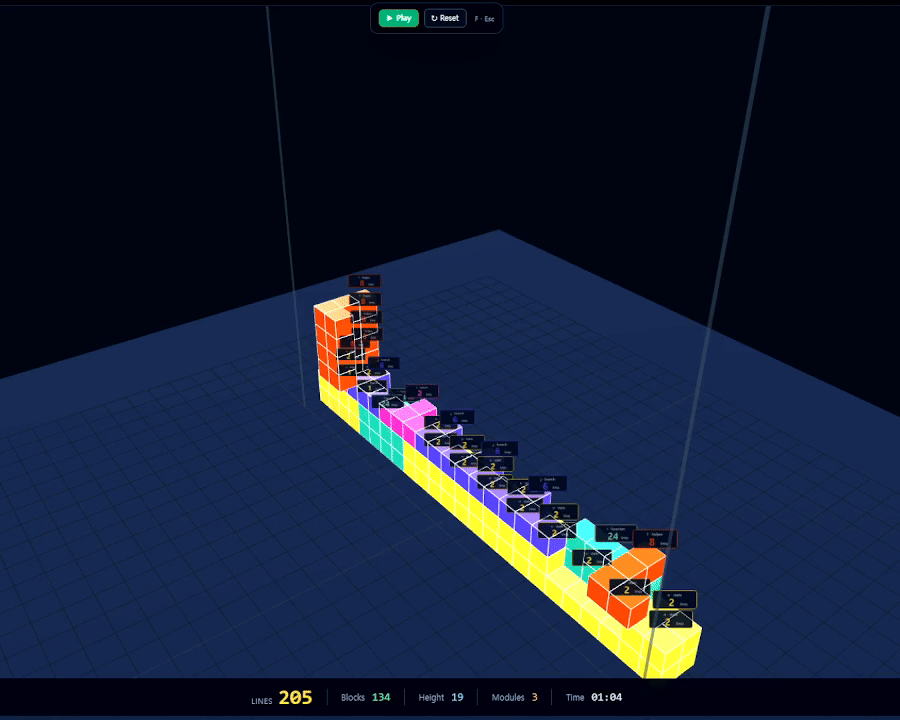

# Tetris Code Viz

> Watch AI-generated code stack into 3D blocks.

Tetris Code Viz is a single-file 3D visualization experiment for AI-generated code, Git diffs, and coding-session style outputs.

Paste code or import a session-like trace, then watch the structure become falling blocks.

**One HTML file. No build. No backend. CDN-loaded.**

[Live Demo](https://tetris-code-viz.vercel.app) · [GitHub](https://github.com/ChanKi-arch/tetris-code-viz) · LinkedIn

---

## Preview

<p align="center">
  
</p>

---

## What it does

Tetris Code Viz turns code structure into a 3D block-based scene.

It maps common code elements into visual roles:

| Code element | Visual role |
|---|---|
| `import` / `require` | Foundation |
| `function` / `method` | Vertical column |
| `if` / `else` / `switch` | Branch hub |
| `loop` / `map` / `forEach` | Repeating span |
| `helper` / `util` | Side attachment |
| `return` | Roof cap |
| `try` / `catch` / `throw` | Safety / recovery module |
| route / API handler | Entry block |

And each tech stack becomes a different material — Python skeleton, JSON interior, HTML/CSS facade, SQL walls, Docker foundation, tests as safety systems, `.env` as wiring.

The goal is not to replace code review or static analysis.

The goal is to make code growth, structure, and complexity easier to see.

---

## Why I built this

AI coding tools are getting faster.

Claude Code, Codex, Cursor, and similar tools can generate or modify large amounts of code across multiple files. But when AI-generated changes grow quickly, it becomes harder to understand the structure that is forming underneath.

I wanted a visual side view:

- Which files are growing?
- Where is the core logic forming?
- How are branches and helpers spreading?
- Is the codebase becoming a tower, a campus, or spaghetti?
- How does a coding session change the shape of a project over time?

This project started as a playful Tetris-style visualization.

The deeper research direction is a **3D architectural sidecar for AI coding sessions** — a way to visualize how code structure evolves over time.

---

## Features

- 3D block visualization (Three.js)
- Tetris-style code structure mapping
- Single-file HTML prototype
- No build step
- Client-side only
- Session-style import adapters (Cursor / Claude Code / Codex / Generic / Git Diff)
- Strategy comparison view
- Before / After / Diff code view
- Dependency graph view
- 5 themes (Cyberpunk · Classic · Minimal · Industrial · Nature)
- Architecture archetype classifier — Tower / Campus / Warehouse / Pagoda / Spaghetti
- Cartridge presets (Fast Prototype · Refactor First · Conservative · Default)
- Optional BYOK LLM (OpenAI SDK-compatible — works with OpenAI / Qwen / DeepSeek / LM Studio / Ollama)
- Replay-style construction sequence

---

## Supported inputs

The current prototype includes experimental support for:

- Pasted source code
- Git diff text
- Cursor-style session data
- Claude Code-style session data
- Codex-style output data
- Generic patch/session format

These adapters are experimental and may change.

---

## Quick start

Clone the repo and open `index.html` in any modern browser.

```bash
git clone https://github.com/ChanKi-arch/tetris-code-viz.git
cd tetris-code-viz
open index.html       # macOS
start index.html      # Windows
xdg-open index.html   # Linux
```

Or deploy it to Vercel with one click — the included `vercel.json` is ready to go.

No install. No build step. No backend.

---

## Tech stack

- HTML
- React 18 via CDN (production UMD)
- Three.js (`0.128.0`) via CDN
- Tailwind CSS via CDN
- Babel standalone for JSX in the browser
- 100% client-side rendering

---

## Project structure

This project is intentionally simple:

```
tetris-code-viz/
├── index.html      # main prototype (single file)
├── og.svg          # Open Graph / social preview image
├── vercel.json     # deployment config
├── LICENSE         # MIT (code) + patent notice
├── README.md       # this file
├── .gitignore
└── assets/
    └── demo.gif    # optional recording / screenshot
```

The main prototype currently lives in a single HTML file. This is intentional for the v0 — easy to clone, share, and reason about.

---

## v0 honest disclosure

- **Mock line parser** — the current build uses a regex-based per-line parser instead of a real AST. Edge cases (multi-line strings, decorators, comments containing keywords) can be misclassified. A real AST integration is planned for v1.
- **Single HTML file** — intentional. No build step makes the demo zero-friction; module split is on the radar but not the priority.
- **Desktop-first** — the 3-panel layout with the Three.js viewport is not yet optimized for mobile.
- **Input cap** — very large codebases get truncated by `MAX_LINES`. Use a representative slice for now.

---

## Roadmap

### Public demo

- [x] Tetris-style 3D block visualization
- [x] Single-file HTML deployment
- [x] Client-side rendering
- [x] Git diff import path
- [x] Cursor / Claude Code / Codex-style adapter layer
- [x] Sample project presets
- [x] Theme system
- [x] BYOK LLM (optional)
- [ ] Better README screenshots
- [ ] Short demo video
- [ ] Cleaner public examples
- [ ] Real AST parser (TypeScript / Python)
- [ ] Module split (single HTML → src/)
- [ ] Mobile layout

### Research direction

- [ ] 3D architectural sidecar mode
- [ ] Folder-to-site mapping
- [ ] File-to-building mapping
- [ ] Dependency-to-bridge / pipe / cable mapping
- [ ] Sequential construction replay
- [ ] Architecture archetype classifier (Tower · Campus · Plant · Pagoda · Spaghetti)
- [ ] Git history / AI session time-axis playback

---

## Public demo vs deeper direction

This repository is the **public, playful version**.

It uses a Tetris-style metaphor because it is easy to understand and fun to watch.

The deeper direction is **architectural visualization for AI coding sessions**:

- files as buildings
- folders as sites
- dependencies as bridges, pipes, or cables
- code changes as sequential construction
- architecture shape as a diagnostic signal

That direction is being explored separately.

---

## What this is not

Tetris Code Viz is not:

- a full IDE
- a replacement for code review
- a production static analyzer
- a complete architecture governance platform

It is an **experimental interface** for seeing AI-generated code structure.

---

## Possible use cases

- Visualizing vibe coding sessions
- Explaining AI-generated code changes to non-engineers
- Showing code growth to non-specialists
- Reviewing large diffs visually
- Exploring new developer interfaces for AI coding tools
- Experimenting with architecture observability

---

## License

**MIT License** for the source code — use, fork, modify, ship freely.

A **separate KIPO provisional patent** has been filed (2026-05-12) covering specific architectural-visualization methods for AI coding sessions. The MIT license applies to the source code only. Patent rights are **not** granted.

For commercial licensing of the patented methods (e.g. integration into a paid product, hosted SaaS using the protected architecture mapping), please contact the author directly.

See [LICENSE](./LICENSE) for full text.

---

## Contributing

This project is a **personal v0**. Issues and discussion are welcome; PRs are reviewed on a best-effort basis. If you build something interesting on top of this, please open a discussion or reach out — I would love to hear about it.

---

## Contact

Built by **Chan Ki** in Korea.

If you are working on AI coding tools, developer experience, code visualization, or architecture observability, feel free to reach out.

- LinkedIn: <YOUR_LINKEDIN_URL>
- GitHub: <https://github.com/your-username>

---

## Acknowledgments

Inspired by — and respectfully different from — earlier code-as-city work, notably **CodeCity** (Wettel & Lanza, 2007). This project adds a **time-axis** (accumulation, not snapshot) and **stack-as-material** (different tech stacks rendered as different building materials).
